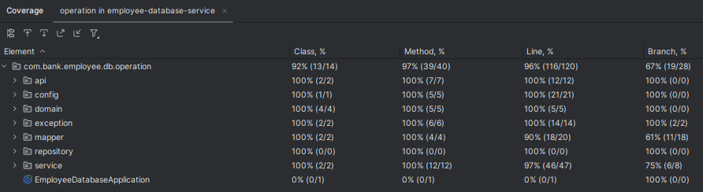

## Employee Database Service

It's an internal API which will be accessed with basic authorization.

# Requirement Clarification

* Many to One between Employee to Project, This means an employee can work on many project. And each project is assigned to one employee.
* Reassign the projects to the default employee after deleting the role and associated employees using procedure. Assuming to create new default employee with available role and assign him to the deleted employees associated projects.

# TODO:

* Create procedure - done
* Docker

# Run Applicaiton Instruction:

* Start application 
* Open H2 database console
* Execute delete_role_store_procedure.sql manually in the database

